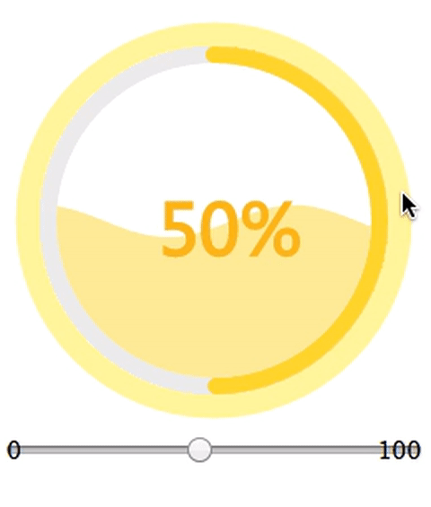
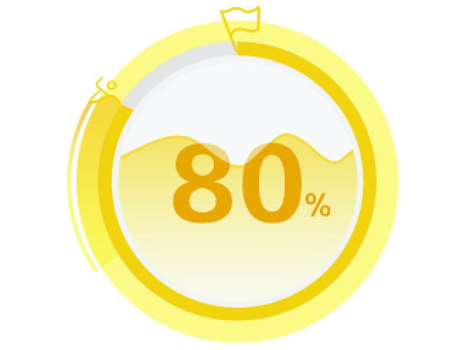

# WaterMoire
使用canvas画的圆形水球波纹带进度条的效果，里面使用的是requestAnimationFrame方法()，所以动画的执行只在区域可见的时候才会执行，十分好用，可以自己设置圆的直径，波纹大小，高度，进度的速率，喜欢的可以start一下，谢谢

### DEMO
<a href="http://blog.itrydo.com/watermoire" target="_blank">demo演示（show demo）</a>

### Introduction
此项目没有使用jquery，使用的是纯js，可以放下使用

## ScreenShot
效果图是要实现下面的效果(最初是需要最外边那个人都得跟着圆环旋转的，现在还没想好怎么写这个，最后还差一些颜色渐变没实现)<br>



## Thanks To
<a href="https://github.com/NumerHero/animations" target="_blank">NumerHero</a>
<br>

## License

```
Copyright 2017 trycatch

Licensed under the Apache License, Version 2.0 (the "License");
you may not use this file except in compliance with the License.
You may obtain a copy of the License at

   http://www.apache.org/licenses/LICENSE-2.0

Unless required by applicable law or agreed to in writing, software
distributed under the License is distributed on an "AS IS" BASIS,
WITHOUT WARRANTIES OR CONDITIONS OF ANY KIND, either express or implied.
See the License for the specific language governing permissions and
limitations under the License.
```